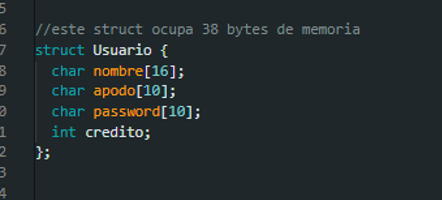

# Práctica 2 - Manual Técnico

## MODULO ADMINISTRADOR
### ALGORITMO PARA AGREGAR USUARIO
Primero debemos de entender lo que sucede a nivel de maquina al momento de almacenar un usuario:  

Como podemos ver tenemos  
Nombre -> 16 bytes 
Apodo -> 10 bytes 
Password -> 10 bytes 
Credito -> 2 bytes 
Por lo tanto este struct tendrá una dimensión total de 38 bytes dentro de la memoria EEPROM 

Aquí surge un problema, ya que los usuarios no será lo único que almacenera nuestra EEPROM, en esta también tendremos:  

